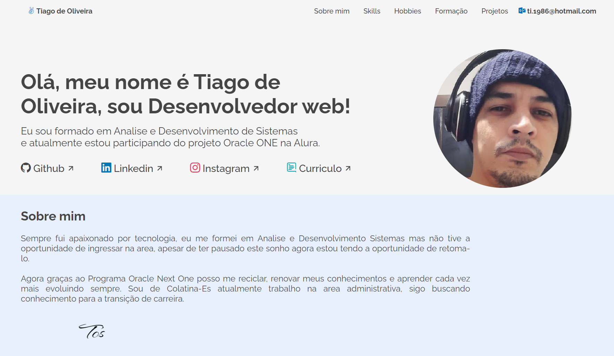

<h1 align="center">Portifolio</h1>

Projeto <strong color="blue"> Oracle One </strong> Challenge Alura + Oracle

  </a>
    <a aria-label="Dias" href="https://github.com/TI-1986/portifolio">
    </img>
  </a>
  

## Projeto

#### O Portifolio foi criado em HTML, CSS e JAVASCRIPT durante o terceiro challenge da Alura.
#### Para testar e alterar o codigo é só fazer o download e rodar localmente com seu server local,
#### Ex.: Live Server no Visual Studio

## Frontend

#### obs: a página está com zoom reduzido a 50%
</img>
